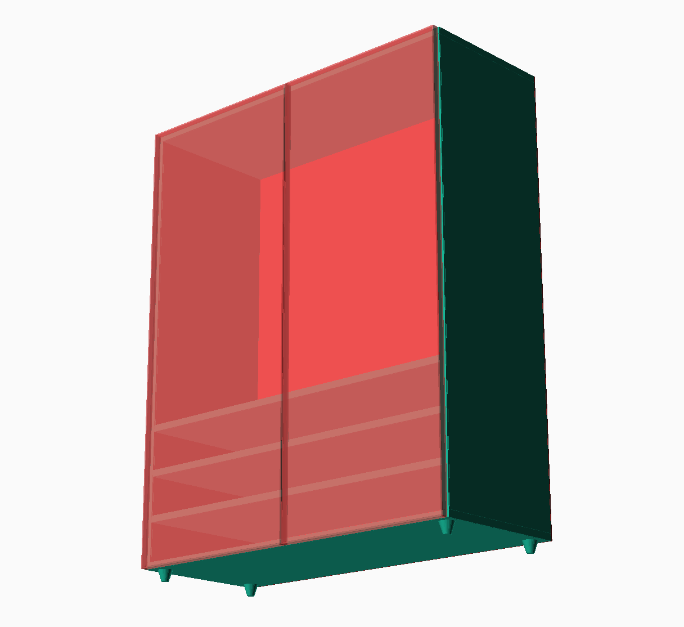

# Woodworker's lib for OpenSCAD

## Installation

1. Open OpenSCAD > File > Show Library Folder
2. Open terminal here
3. `git clone https://github.com/fxdave/woodworkers-lib.git ./woodworkers`
4. Use with `include<woodworkers/std.scad>`

## Tutorial

### 1. First create cubes to position and size the furnitures.
```scad
include<woodworkers/std.scad>

wardrobe=[1000,400,1200];

translate([10,0,0])
cube(wardrobe);
```

### 2. Destructure the cube into planes
```scad
include<woodworkers/std.scad>

wardrobe=[1000,400,1200];

translate([10,0,0])
{
    // frame
    planeLeft(  wardrobe, f=-1, t=-1, b=-1);
    planeRight( wardrobe, f=-1, t=-1, b=-1);
    planeTop(   wardrobe, f=-1);
    planeBottom(wardrobe, f=-1);

    // seethrough doors
    #planeFront(wardrobe, rr=-wardrobe[0]/2-1, ll=-4);
    #planeFront(wardrobe, ll=-wardrobe[0]/2-1, rr=-4);

    // fiberboard back
    color("brown")
    translate([0,4,0]) // I could also remove it from the sides with BB=-4, but it is a better example
    planeBack(wardrobe, thick=4);

    // shelves
    translate([0,0,120]) 
    planeBottom(wardrobe, l=-1, r=-1, f=-1);
    translate([0,0,120*2]) 
    planeBottom(wardrobe, l=-1, r=-1, f=-1);
    translate([0,0,120*3]) 
    planeBottom(wardrobe, l=-1, r=-1, f=-1);

    // legs
    legH=30;
    translate([0,0,-legH]) {
        leg(wardrobe, legH, l=2, f=3);
        leg(wardrobe, legH, r=2, f=3);
        leg(wardrobe, legH, l=2, B=2);
        leg(wardrobe, legH, r=2, B=2);
    }
}
```

### 3. Add 4mm ABS
```scad
include<woodworkers/std.scad>

wardrobe=[1000,400,1200];

translate([10,0,0])
{
    // frame
    planeLeft(  wardrobe, f=-1, t=-1, b=-1, af=4);
    planeRight( wardrobe, f=-1, t=-1, b=-1, af=4);
    planeTop(   wardrobe, f=-1, af=4, al=4, ar=4);
    planeBottom(wardrobe, f=-1, af=4, al=4, ar=4);

    // seethrough doors
    #planeFront(wardrobe, rr=-wardrobe[0]/2-1, ll=-4, al=4, at=4, ar=4, ab=4);
    #planeFront(wardrobe, ll=-wardrobe[0]/2-1, rr=-4, al=4, at=4, ar=4, ab=4);

    // fiberboard back
    color("brown")
    translate([0,4,0]) // I could also remove it from the sides with BB=-4, but it is a better example
    planeBack(wardrobe, thick=4);

    // shelves
    translate([0,0,120]) 
    planeBottom(wardrobe, l=-1, r=-1, f=-1, af=4);
    translate([0,0,120*2]) 
    planeBottom(wardrobe, l=-1, r=-1, f=-1, af=4);
    translate([0,0,120*3]) 
    planeBottom(wardrobe, l=-1, r=-1, f=-1, af=4);

    // legs
    legH=30;
    translate([0,0,-legH]) {
        leg(wardrobe, legH, l=2, f=3);
        leg(wardrobe, legH, r=2, f=3);
        leg(wardrobe, legH, l=2, B=2);
        leg(wardrobe, legH, r=2, B=2);
    }
}
```

### 4. Enjoy the results


log:
```log
ECHO: "plane (left):	18 × 378(4) × 1164"
ECHO: "plane (right):	18 × 378(4) × 1164"
ECHO: "plane (top):	    992(4,4) × 378(4) × 18"
ECHO: "plane (bottom):	992(4,4) × 378(4) × 18"
ECHO: "plane (front):	487(4,4) × 18 × 1192(4,4)"
ECHO: "plane (front):	487(4,4) × 18 × 1192(4,4)"
ECHO: "plane (back):	1000 × 4 × 1200"
ECHO: "plane (bottom):	964 × 378(4) × 18"
ECHO: "plane (bottom):	964 × 378(4) × 18"
ECHO: "plane (bottom):	964 × 378(4) × 18"
```

## API

**Modules**:

 - `module planeFront(dim, l=0,r=0,t=0,b=0, ll=0,rr=0,tt=0,bb=0, al=0,ar=0,at=0,ab=0, thick=thick)`
 - `module planeBack(dim, l=0,r=0,t=0,b=0, ll=0,rr=0,tt=0,bb=0, al=0,ar=0,at=0,ab=0, thick=thick)`
 - `module planeLeft(dim, f=0,B=0,t=0,b=0, ff=0,BB=0,tt=0,bb=0, af=0,aB=0,at=0,ab=0, thick=thick)`
 - `module planeRight(dim, f=0,B=0,t=0,b=0, ff=0,BB=0,tt=0,bb=0, af=0,aB=0,at=0,ab=0, thick=thick)`
 - `module planeBottom(dim, l=0,r=0,f=0,B=0, ll=0,rr=0,ff=0,BB=0, al=0,ar=0,af=0,aB=0, thick=thick)`
 - `module planeTop(dim, l=0,r=0,f=0,B=0, ll=0,rr=0,ff=0,BB=0, al=0,ar=0,af=0,aB=0, thick=thick)`
 - `module leg(dim, legHeight, l=0,r=0,f=0,B=0,ll=0,rr=0,ff=0,BB=0, thick=thick)`
    - Add example legs starting from z=0 to z=legHeight
    - Here all arguments point towards the center, so you should add positive values

**Thickness** is `18` by default, but you can change it with e.g.: `thick=16;`

**Arguments**:

 - dim = the size of the furniture
 - thick = the thickness of the plane

**Increments relative to thickness (e.g.: -1 = -1*thickness)**:
 - l = left
 - r = right
 - t = top
 - b = bottom
 - f = front
 - B = Back

**Absolute increments (e.g.: ll=10 adds 10mm to the left )**:
 - ll = left
 - rr = right
 - tt = top
 - bb = bottom
 - ff = front
 - BB = Back

**ABS (e.g.: al=4 adds 4mm ABS to the left side)**: 
 - al = ABS to the plane's left side
 - ar = ABS to the plane's right side
 - at = ABS to the plane's top side
 - ab = ABS to the plane's bottom side
 - af = ABS to the plane's front side
 - aB = ABS to the plane's Back side
